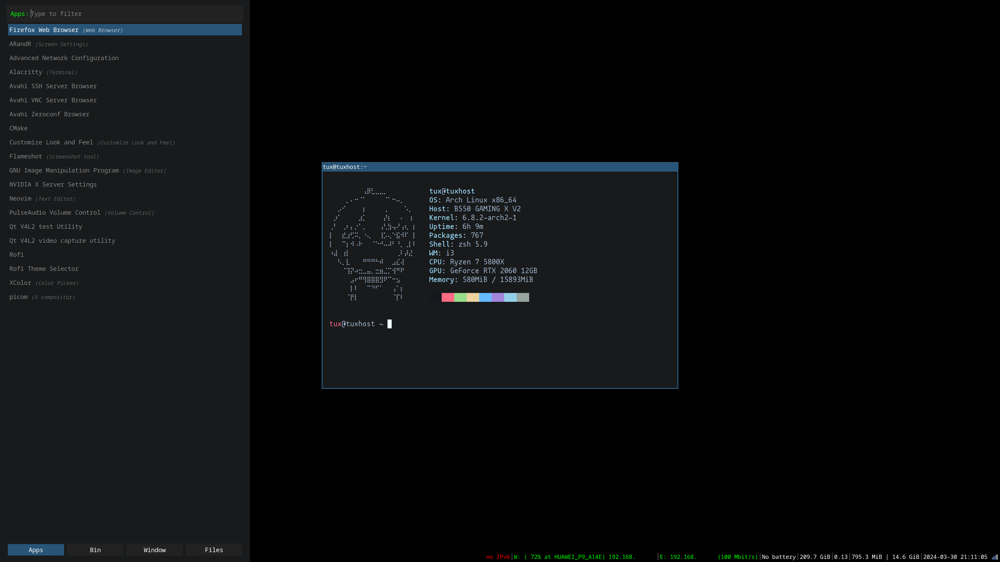

# Dotfiles



## System Info
- OS: [Arch Linux](https://archlinux.org/)
- WMs: [i3](https://i3wm.org/), [Xmonad](https://xmonad.org/)
- Terminal: [alacritty](https://alacritty.org/)
- Shell: [zsh](https://www.zsh.org)
- Editor: [lunarvim](https://www.lunarvim.org/es/)
- Desktop panel: [conky](https://github.com/brndnmtthws/conky)
- Compositor: [picom](https://github.com/yshui/picom)
- Web browser: [firefox](https://www.mozilla.org/es-ES/firefox/new/)

## GTK Theming 
- Widget Theme: [Orchis](https://www.gnome-look.org/p/1357889)
- Icon Theme: [Kora](https://www.gnome-look.org/p/1256209)
- Cursor Theme: [BreezeX Light](https://github.com/ful1e5/BreezeX_Cursor/releases/)

## Considerations

### Other programs (optional)

- Image viewer/wallpaper manager: [feh](https://archlinux.org/packages/extra/x86_64/feh/)
- System information: [neofetch](https://archlinux.org/packages/extra/any/neofetch/)
- System monitor: [btop](https://archlinux.org/packages/extra/x86_64/btop/)
- Screenshots: [flameshot](https://archlinux.org/packages/extra/x86_64/flameshot/)
- Fancy ls command: [lsd](https://archlinux.org/packages/extra/x86_64/lsd/)
- Desktop color picker: [xcolor](https://archlinux.org/packages/extra/x86_64/xcolor/)

### Keybindigs

Generic keybindings for all window managers:

| Keys                 | Action                            |
|----------------------|-----------------------------------|
| Win + q              | Close focused window              |
| Win + d              | Open application launcher         |
| Win + x              | Open power menu                   | 
| Win + [1-..]         | Switch to workspace N[1-..]       |
| Win + Shift + [1-..] | Send Window to workspace N[1-..]  |
| Win + Shift + s      | Take a screenshot                 |
| Win + Shift + r      | Restart window manager            |
| Win + Shift + q      | Kill/quit window manager          |
 
# Other settings

If you need a password to shutdown, reboot, etc, you might need to add your user
to the `power` group. This will be helpull if you try to choose any of the options
of the rofi-powermenu and nothing happens.

```bash
sudo gpasswd -a $(whoami) power
```

If that does not work and you use `sudo`, try to add your user to the `wheel` group, 
and then, change the next line of the sudoers file with the command `visudo`:

```bash
# Uncomment this line
%wheel ALL=(ALL:ALL) NOPASSWD: ALL
```

Now you should be able to do `sudo systemctl shutdown/hibernate/...` without needing
and password.
